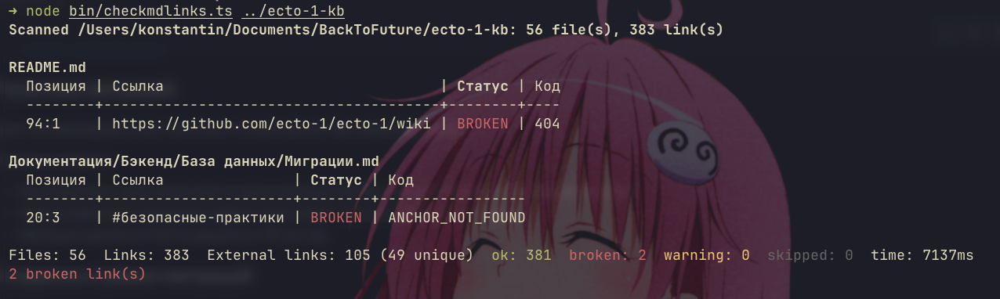

# AGENDA — статистика подготовки репозитория

Расход ресурсов на: обсуждение задачи → план → генерацию `SPEC.md` → генерацию
этого файла → доработку спецификации (раздел про `README.md`).

## Модель

| Параметр | Значение |
|---|---|
| Модель | Claude Opus 5 (`claude-opus-5`, окно контекста 1M) |
| Агент | Claude Code (CLI) |
| Дата | 2026-08-17 |
| Длительность сессии | ~14 минут (11:00:18 → 11:14:00 UTC) |
| Сообщений ассистента (с биллингом) | 47 |

## Токены

| Категория | 1. Планирование | 2. Генерация SPEC + AGENDA | 3. Доработка спеки | Всего |
|---|---:|---:|---:|---:|
| Input (без кэша) | 52 | 20 | 22 | 94 |
| Cache write (запись в кэш) | 69 442 | 729 986 | 12 055 | 811 483 |
| Cache read (чтение из кэша) | 1 238 483 | 662 952 | 4 701 759 | 6 603 194 |
| Output | 22 966 | 23 316 | 8 815 | 55 097 |
| Сообщений ассистента | 26 | 10 | 11 | 47 |

Границы этапов: этап 1 заканчивается вызовом `ExitPlanMode` (утверждение плана
пользователем), этап 2 — первым коммитом, этап 3 — правки `SPEC.md` (секция
`README.md`) и пересчёт этого файла.

Почему cache read такой большой на этапах 2–3: на этапе 2 разово загружен
справочный skill `claude-api` (~700K токенов контекста) для получения
актуального прайса модели, и дальше этот контекст перечитывается из кэша
на каждом запросе. Output-токены (реальная «работа») — всего 55K.

## Ориентировочная стоимость (оценка)

Прайс Claude Opus 5: input $5 / 1M, output $25 / 1M, cache write (TTL 5 мин)
$6.25 / 1M (×1.25 от input), cache read $0.50 / 1M (×0.1 от input).

| Этап | Стоимость |
|---|---:|
| 1. Планирование | ≈ $1.63 |
| 2. Генерация SPEC.md + AGENDA.md | ≈ $5.48 |
| 3. Доработка спеки (README + пересчёт) | ≈ $2.65 |
| **Итого** | **≈ $9.75** |

Пометка: это оценка по публичному прайсу API, а не фактический счёт
(подписочные тарифы Claude Code считаются иначе).

## Методика замера

Цифры не оценочные — они посчитаны по транскрипту сессии, где Claude Code
сохраняет поле `usage` каждого ответа модели.

- Источник: `~/.claude/projects/-Users-konstantin-Documents-BackToFuture-check-markdown-links/31028e4d-08ed-4ee3-8428-055d0c0eb725.jsonl`
- Считались все записи с непустым `message.usage`: `input_tokens`,
  `cache_creation_input_tokens`, `cache_read_input_tokens`, `output_tokens`.
- Границы этапов — по индексу сообщения с `tool_use` `name: "ExitPlanMode"`
  и по сообщению с коммитом.

Воспроизвести (суммирование всей сессии):

```sh
node -e '
const fs=require("fs");
const t={inp:0,cc:0,cr:0,out:0,n:0};
for (const l of fs.readFileSync(process.argv[1],"utf8").trim().split("\n")) {
  let j; try { j=JSON.parse(l) } catch { continue }
  const u=j.message&&j.message.usage; if(!u) continue;
  t.n++; t.inp+=u.input_tokens||0; t.cc+=u.cache_creation_input_tokens||0;
  t.cr+=u.cache_read_input_tokens||0; t.out+=u.output_tokens||0;
}
console.log(t, "cost=$"+((t.inp*5+t.cc*6.25+t.cr*0.5+t.out*25)/1e6).toFixed(4));
' <путь-к-транскрипту>.jsonl
```

Срез замера: 2026-08-17 11:14:00 UTC — момент непосредственно перед перезаписью
этого файла. Токены самой записи `AGENDA.md` и последующего коммита в цифры
выше не входят (это ещё ~2–3 тысячи output-токенов и ~0.5M cache read).

## Реализация приложения по SPEC.md

Отдельная сессия: выполнение промпта «сделай по спеке, сгенерируй тесты,
проверь, допиши AGENDA.md» — от чтения `SPEC.md` до полного рабочего
приложения (`bin/`, `src/`, `test/`, `README.md`) с зелёным `npm test`.

| Параметр | Значение |
|---|---|
| Модель | Claude Sonnet 5 (`claude-sonnet-5`) |
| Агент | Claude Code (CLI) |
| Дата | 2026-08-17 |
| Длительность сессии | ~28 минут (11:15:40 → 11:43:25 UTC) |
| Сообщений ассистента (с биллингом) | 213 |

В ходе этой сессии пользователь также попросил перейти с чистого JS на `.ts`
с нативным type-stripping Node 24 (без `tsc`/`@types` в зависимостях) — решение
зафиксировано правкой `SPEC.md` §2, реализация выполнена в `.ts` с самого
начала этой сессии.

### Токены

| Категория | Значение |
|---|---:|
| Input (без кэша) | 426 |
| Cache write (запись в кэш) | 1 068 088 |
| Cache read (чтение из кэша) | 29 678 023 |
| Output | 290 065 |

### Ориентировочная стоимость (оценка)

Прайс Claude Sonnet 5 на дату сессии (интро-тариф, действует до 2026-08-31):
input $2.00 / 1M, output $10.00 / 1M, cache write (TTL 5 мин) $2.50 / 1M
(×1.25 от input), cache read $0.20 / 1M (×0.1 от input).

**Итого: ≈ $11.51.**

Пометка: как и в разделе выше — оценка по публичному API-прайсу с учётом
временной интро-скидки, а не фактический счёт по подписке Claude Code.

### Методика замера

Идентична методике из раздела выше (см. код и формулу там же), применена к
файлу транскрипта этой сессии:
`~/.claude/projects/-Users-konstantin-Documents-BackToFuture-check-markdown-links/17eecb78-cb06-4764-8784-475cd7dac9db.jsonl`,
с заменой коэффициентов прайса на актуальные для Claude Sonnet 5
(input $2/$3, cache write $2.5/$3.75, cache read $0.2/$0.3, output $10/$15 —
интро/стандартный тариф).

Срез замера: 2026-08-17 11:43:25 UTC — непосредственно перед записью этого
раздела. Токены самой записи в `AGENDA.md` в цифры выше не входят.

## Редизайн текстового отчёта в таблицу

Промпт: «сделай более красивый вывод в виде таблицы (ссылка, статус, код при
broken; цвета ok/warning/broken), после таблицы — общая сводка (файлы,
ссылки, внешние ссылки, счётчики по статусам)» — правка `src/report.ts`
(ASCII-таблица с заголовком и разделителем, показ всех статусов, а не только
проблемных) + синхронизация `SPEC.md` §11 и примера в `README.md`.

| Параметр | Значение |
|---|---|
| Модель | Claude Sonnet 5 (`claude-sonnet-5`) |
| Агент | Claude Code (CLI) |
| Дата | 2026-08-17 |
| Длительность | ~14 минут (11:43:30 → 11:57:51 UTC) |
| Сообщений ассистента (с биллингом) | 49 |

### Токены

| Категория | Значение |
|---|---:|
| Input (без кэша) | 98 |
| Cache write (запись в кэш) | 64 484 |
| Cache read (чтение из кэша) | 24 111 998 |
| Output | 41 861 |

### Ориентировочная стоимость (оценка)

По тому же интро-тарифу Claude Sonnet 5 (см. раздел выше: input $2.00/1M,
output $10.00/1M, cache write $2.50/1M, cache read $0.20/1M):

**Итого: ≈ $5.40.**

Срез замера: 2026-08-17 11:57:51 UTC, до записи этого раздела и до повторного
прогона по репозиторию `ecto-1-kb` в этом же ответе — их токены сюда не
входят.

## Только сломанные ссылки в таблице + проверка якорей

Промпт: «выводи в таблице только сломанные ссылки со статусами; не пропускай
внутренние ссылки типа `[Чеклист быстрого старта](#чеклист-быстрого-старта)`,
их тоже проверяй». Два изменения:

1. Таблица в текстовом режиме вернулась к показу только `broken`-строк
   (откат части предыдущего редизайна — полный список статусов остался
   только в JSON и в итоговой сводке).
2. Реализована проверка существования якорей (`#section`), которая раньше
   была вне объёма (SPEC.md §15): `extractHeadingAnchors`/`slugifyHeading` в
   `src/extract.ts`, `checkAnchor` в `src/check-local.ts`, поле `anchor` в
   `classify()` (`src/resolve.ts`), причина `broken`/`ANCHOR_NOT_FOUND`.
   Синхронизированы `SPEC.md` (§8, §9.1, §11, §12, §15) и `README.md`.

Проверка на реальном репозитории (`ecto-1-kb`) сразу выявила два бага в
приближении алгоритма слагов GitHub, оба исправлены и закреплены тестами:
слаги не учитывали явные HTML-якоря `<a id="...">` (частый паттерн ручного
оглавления) и неверно схлопывали несколько подряд идущих пробелов в один
дефис вместо посимвольной замены (из-за чего "8. Auth / Token" должно давать
`8-auth--token`, а не `8-auth-token`). После исправлений находки на реальном
репозитории сократились с 14 ложных до 2 подтверждённых поломанных ссылок.

| Параметр | Значение |
|---|---|
| Модель | Claude Sonnet 5 (`claude-sonnet-5`) |
| Агент | Claude Code (CLI) |
| Дата | 2026-08-17 |
| Длительность | ~29 минут (11:57:57 → 12:26:28 UTC) |
| Сообщений ассистента (с биллингом) | 160 |

### Токены

| Категория | Значение |
|---|---:|
| Input (без кэша) | 320 |
| Cache write (запись в кэш) | 181 506 |
| Cache read (чтение из кэша) | 90 546 606 |
| Output | 111 974 |

Столь большой cache read объясняется длиной сессии в целом: контекст (в т.ч.
разово загруженный справочный skill `claude-api` на предыдущем шаге) с каждым
новым запросом перечитывается из кэша целиком.

### Ориентировочная стоимость (оценка)

По тому же интро-тарифу Claude Sonnet 5 (input $2.00/1M, output $10.00/1M,
cache write $2.50/1M, cache read $0.20/1M):

**Итого: ≈ $19.68.**

Срез замера: 2026-08-17 12:26:28 UTC, до записи этого раздела — её токены
сюда не входят.

## Общие итоги

Сводка по всем этапам работы над проектом от первого обсуждения задачи до
текущего момента — два разных агента/модели: обсуждение задачи и написание
`SPEC.md` делала Claude Opus 5 (сессия из `AGENDA.md`, раздел «Модель» вверху
файла), всю реализацию по спеке и последующие доработки — Claude Sonnet 5
(сессия Claude Code в этом репозитории).

### Токены — всего по всем этапам

| Этап | Модель | Input | Cache write | Cache read | Output | Стоимость |
|---|---|---:|---:|---:|---:|---:|
| 1. Планирование | Opus 5 | 52 | 69 442 | 1 238 483 | 22 966 | ≈ $1.63 |
| 2. Генерация SPEC.md + AGENDA.md | Opus 5 | 20 | 729 986 | 662 952 | 23 316 | ≈ $5.48 |
| 3. Доработка спеки (README) | Opus 5 | 22 | 12 055 | 4 701 759 | 8 815 | ≈ $2.65 |
| 4. Реализация приложения по SPEC.md | Sonnet 5 | 426 | 1 068 088 | 29 678 023 | 290 065 | ≈ $11.51 |
| 5. Редизайн отчёта в таблицу | Sonnet 5 | 98 | 64 484 | 24 111 998 | 41 861 | ≈ $5.40 |
| 6. Только broken + проверка якорей | Sonnet 5 | 320 | 181 506 | 90 546 606 | 111 974 | ≈ $19.68 |
| **Итого** | — | **938** | **2 125 561** | **150 939 821** | **498 997** | **≈ $46.35** |

**Всего токенов (input + cache write + cache read + output): 153 565 317.**

Подавляющая часть — `cache read` (150.9M из 153.6M, ~98%): длинная сессия с
разово загруженным справочным контекстом (skill `claude-api` на этапе
планирования, плюс накопленная история самого проекта), перечитываемым из
кэша на каждом следующем запросе. Реальная «работа» модели (то, что она
сама сгенерировала) — это столбец `Output`, суммарно **≈ 499K токенов**.
Оценка стоимости — по публичному API-прайсу (Opus 5: $5/$25 за 1M
input/output; Sonnet 5: интро-тариф $2/$10, действует до 2026-08-31), не
фактический счёт по подписке Claude Code.

### Уточняющие промпты после реализации по спеке

После исходного промпта «сделай по спеке» (который включал первую
реализацию, тест-сьют и первую запись в `AGENDA.md`) было **5** уточняющих/
доп. промптов:

1. «давай проверим вот на этом репозитории» — прогон на `ecto-1-kb`.
2. «сделай более красивый вывод в виде таблицы» — редизайн отчёта.
3. «дай мне команду чтоб я сам отдельно запустил» — без изменений кода.
4. «выводи в таблице только сломанные ссылки… проверяй и внутренние ссылки»
   — откат части редизайна + новая фича (проверка якорей).
5. «допиши в AGENDA общие выводы…» — этот промпт.

(Не считаются как отдельные уточняющие промпты два коротких сообщения внутри
самой первой реализации — про нативный TypeScript в Node 24 и про локально
установленный `tsc` — они были частью одного и того же захода на
реализацию по спеке, до её завершения.)

### Скриншот

Скриншот терминала пользователя — независимый прогон того же `checkmdlinks`
на той же папке `ecto-1-kb`, результат идентичен прогону в этой сессии
(1 битая внешняя ссылка + 1 битый якорь):


